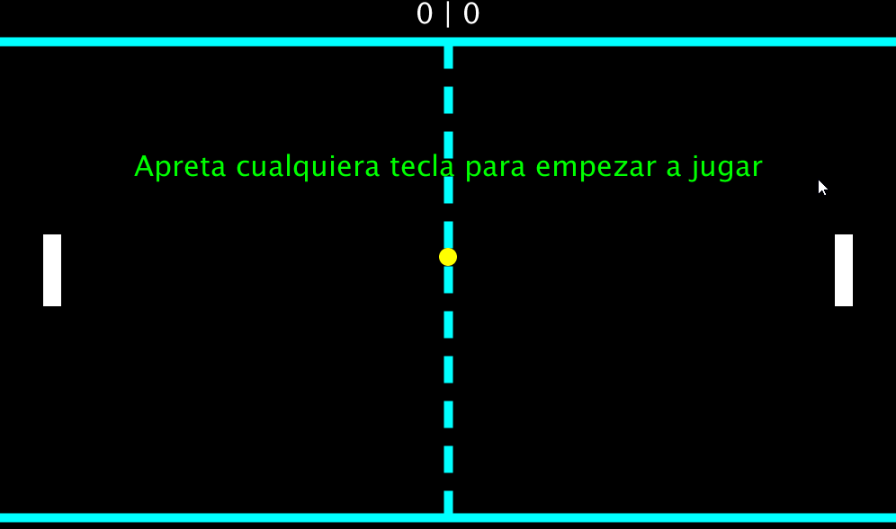

# PongSensor

A 2 player's game in which the movement of the first player is controlled with a sensor.
 In order to launch the game you need <b>Arduino Sharp GP2D12</b> sensor. You will have to upload the compiled program from <i>distancesensor.ino</i> code to the sensor before launching the game.

The program was made with <i>Processing 3.5.7</i> and Arduino.
 There is also <i>.exe</i> executable file for <b>Windows x64</b> and the executable for <b>Linux x64</b>.

To start the game you have to press any button.

### First player's controls:
	Change the distance between the sensor and some object (hand, book, etc.)

### Second player's controls:
	UP ARROW - go up
	DOWN ARROW - go down

## Animation:

